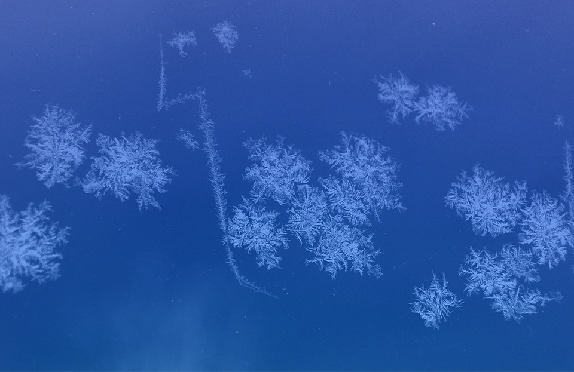
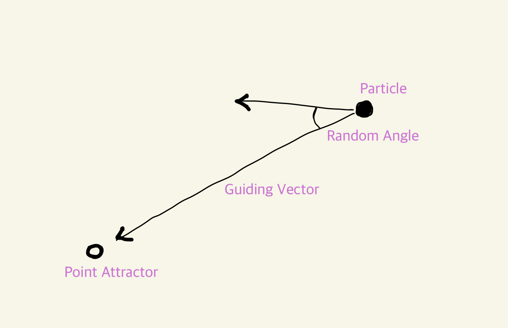
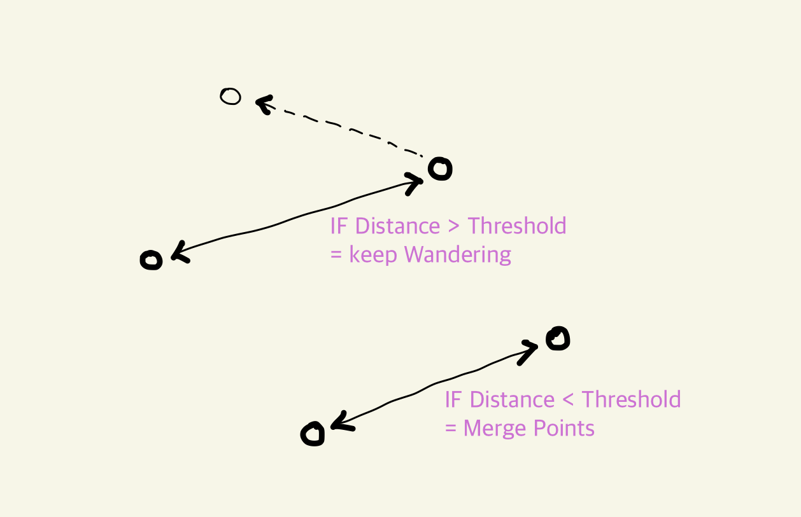
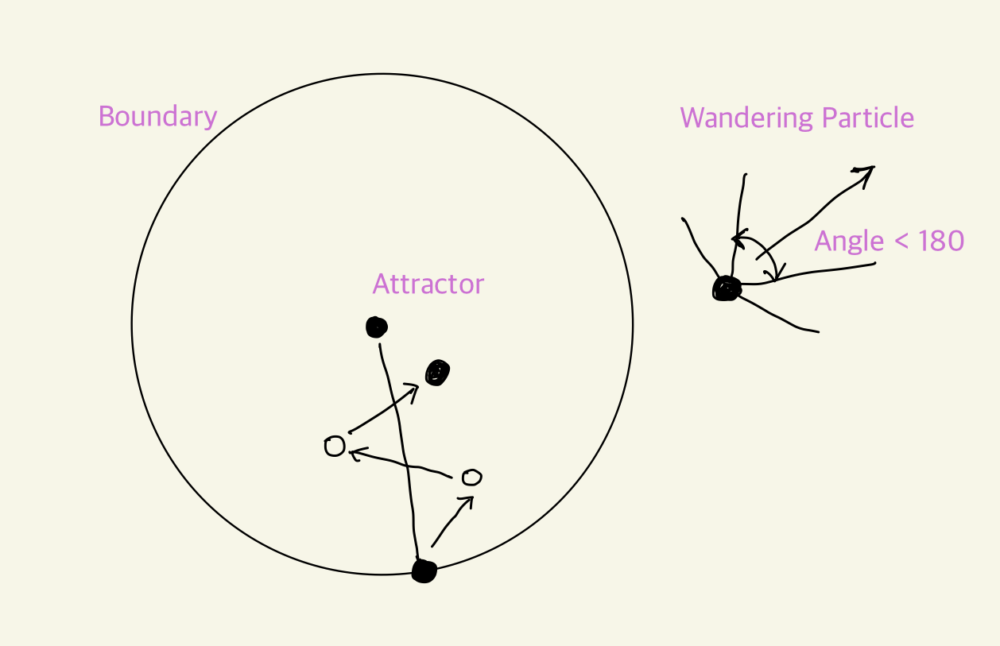
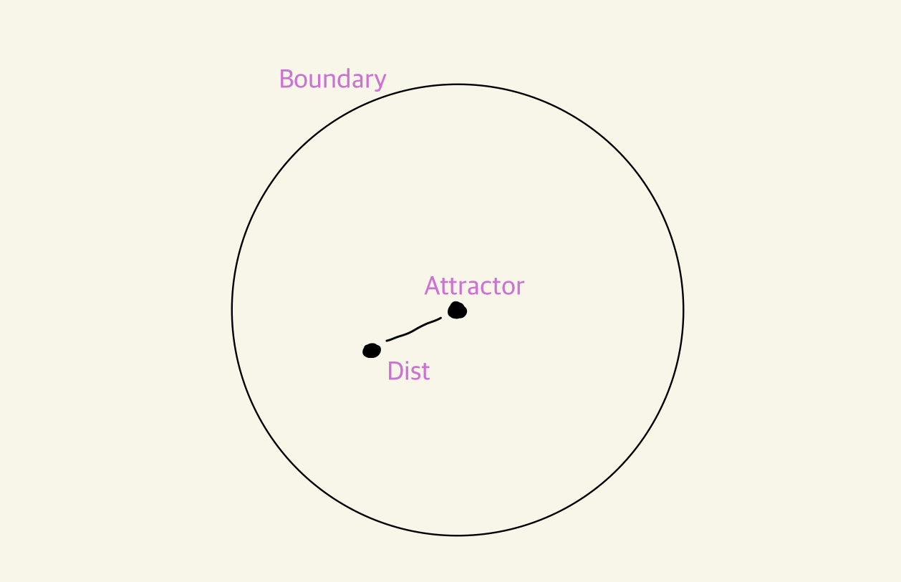
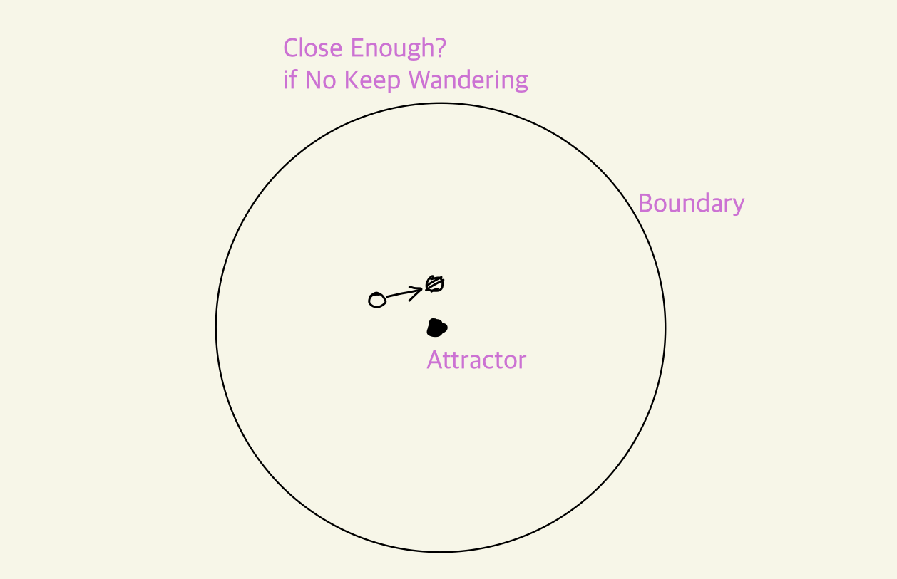
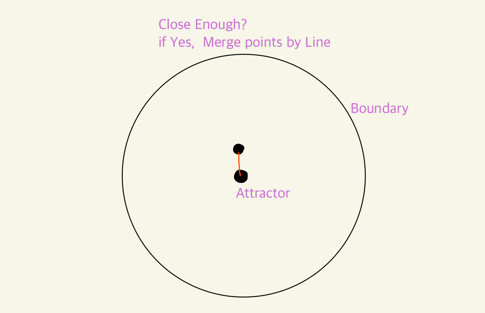
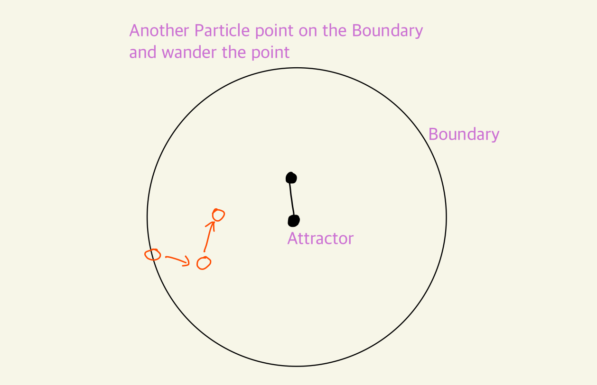

# Diffusion Limited Aggregation (DLA) System 

Parametric, Computational Design mini Project

## intro

### 🎯 **Project Goal**

👉 *Implementing Diffusion Limited Aggregation System Pattern*

 

### **Background**

Diffusion Limited Aggregation은 겨울철 눈 결정을 현미경으로 바라보았을때 확인할 수 있습니다. 이는 자연에서 쉽게 찾아볼 수 있는 한가지 패턴입니다.

독립적인 입자들이 공기나 유체를 자유롭게 부유할때 특정 거리안으로 가까워지면 서로의 인력으로 결합되어 또 다른 하나의 큰 입자를 만들며 이는 또 다른 부유하는 입자를 연속적으로 끌어당깁니다. 결과적으로 나무의 가지가 뻗어나가는 듯한 패턴을 만들어냅니다.

이러한 현상을 한 가지 알고리즘이라고 할때, 이 Diffusion Limited Aggregation 알고리즘은 두가지의 하부 알고리즘으로 나눌 수 있습니다. 
한 가지는 유체에서 부유하는 입자의 움직임(Brownian Motion)에 대한 알고리즘이고, 두 번째는 입자들 간의 거리에 따라서 입자들을 결합하는 방식에 대한 알고리즘입니다. 이 두가지는 서로 반복적으로 발생하며, 아래와 같이 과정을 나열해 볼 수 있습니다. 

 

## 📐 Algorithm of Diffusion-Limited Aggregation
브라운 운동으로 인해 임의운동을 하는 입자들이 서로 뭉쳐서 입자들의 집합체를 형성하는 과정 (위키백과에서 발췌). 이 과정은 크게 두 가지로 나눌 수 있습니다.

- **Diffusion (Wandering Particle)**   : 두 점으로 시작합니다. 하나는 끌어당기는 역할을 하는 상태 (static working as an atteractor) 이며, 다른 하나는 시간이 지남에 따라 끌어당기는 쪽으로 서서히 접근하는 배회하는 파티클 Wandering particle 입니다.

- **Aggregation (Sticking Particles within threshold)**   : 두 지점이 충분히 가까운지 지속적으로 확인한다. 임계값Threshold에 도달하면 방황을 멈추고 두 점을 하나의 선으로 연결하여 병합, 그렇지 않으면 파티클Particles이 임계값에 도달할 때까지 계속 배회하도록 놓아둔다.

 

## Process

**step 01**  
주어진 경계에서 임의의 점을 구합니다. 이 점은 경계 내에서 거닐면서 점차적으로 끌어당기는 요소에 접근합니다. 이 점은 여전히 끌어당기는 역할을 하므로 첫 번째 집합체가 됩니다.

**step 02**  
입자가 돌아다닐 때는 임의의 각도를 180도 미만으로 유지하여 입자가 끌어당기는 쪽을 향해 움직이도록 합니다. 그렇지 않으면 입자가 공간에서 소실될 수 있습니다.

**step 03**  
입자를 움직일 때마다 두 점 사이의 거리를 확인하여 병합할 수 있을 만큼 가까운지 확인합니다.

**step 04**  
충분히 가깝지 않으면 입자를 계속 돌아다니게 합니다.

**step 05**  
충분히 가깝다면 두 점을 병합하여 하나의 선으로 연결합니다. 두 점이 새로운 집합을 형성합니다.

**step 06**  
경계에 또 다른 임의의 점을 하나 더 가져와서 돌아다니게 합니다.

**step 07**  
입자가 움직일 때마다 돌아다니는 입자에서 각 병합된 집합까지의 거리를 확인합니다. 두 거리 중 하나라도 임계값 내에 있으면 입자를 더 가까운 집합에 병합합니다. 둘 중 어느 것도 조건을 충족하지 않으면 파티클을 계속 돌아다니게 합니다.

**step 08**  
패턴의 모양이 마음에 들때까지 반복합니다.

 

## **Implement** 
by rhino3d grasshopper and Python
